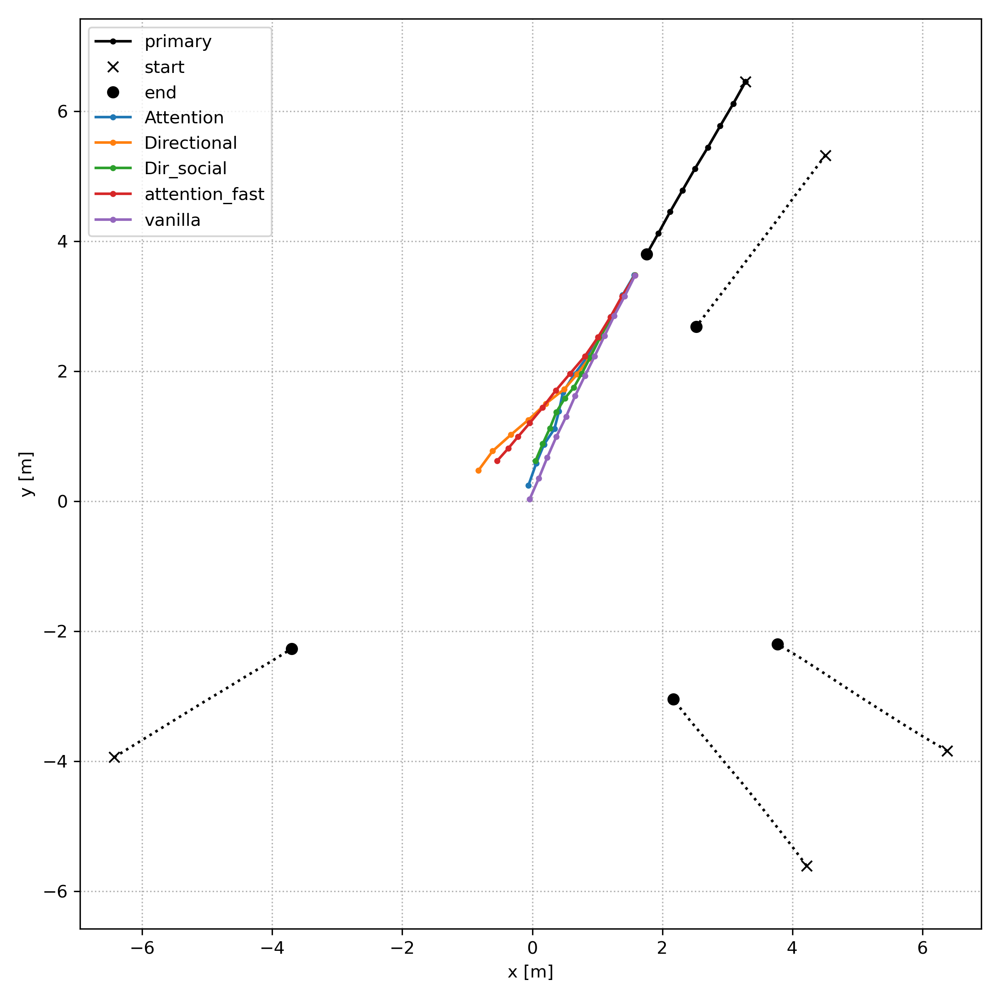
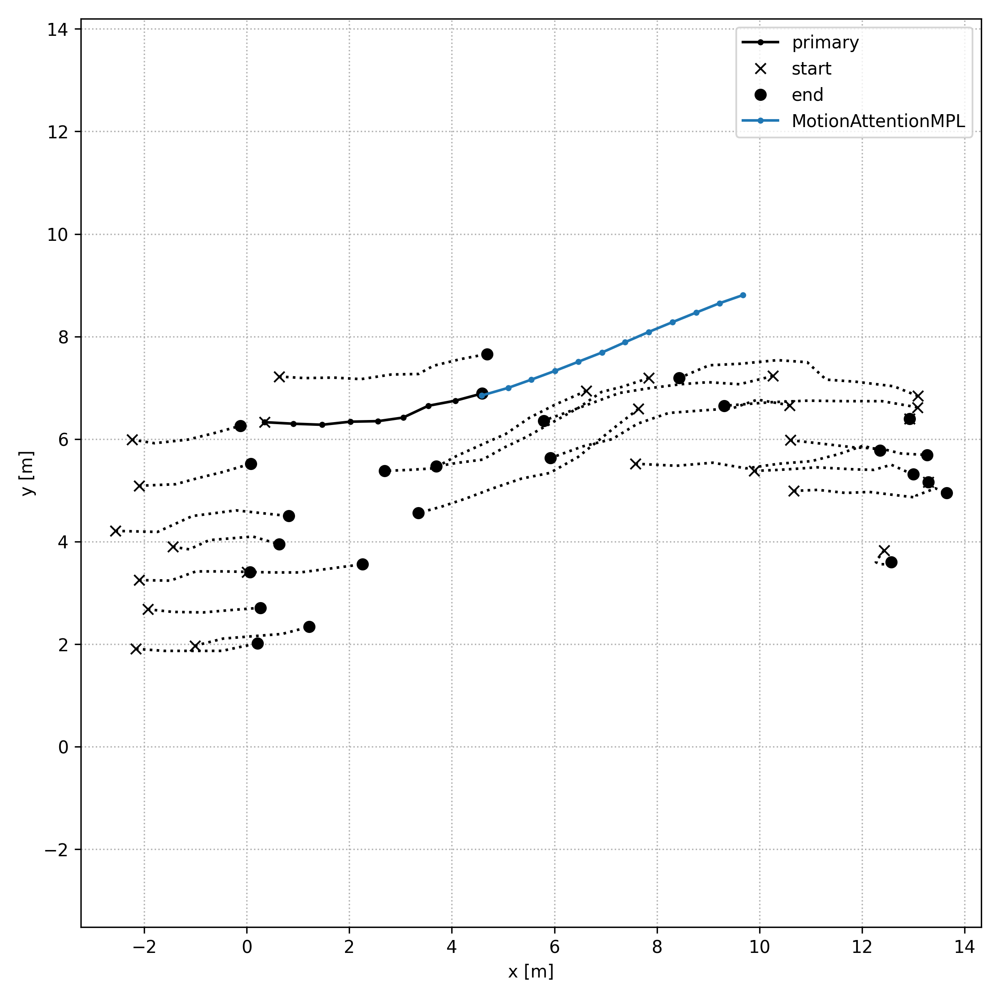
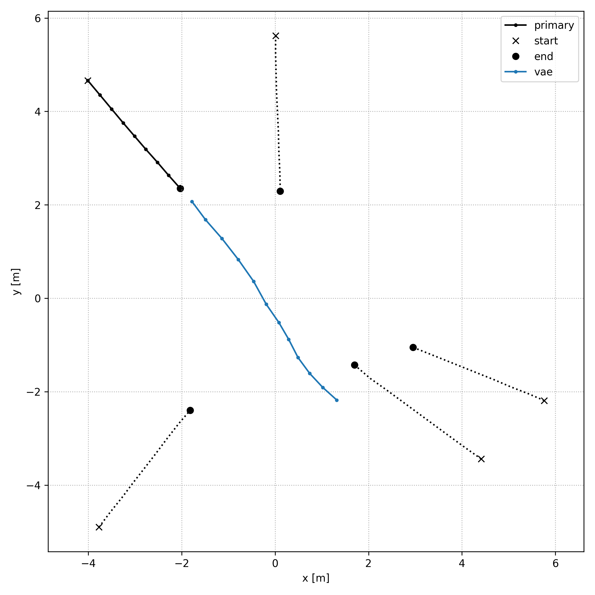
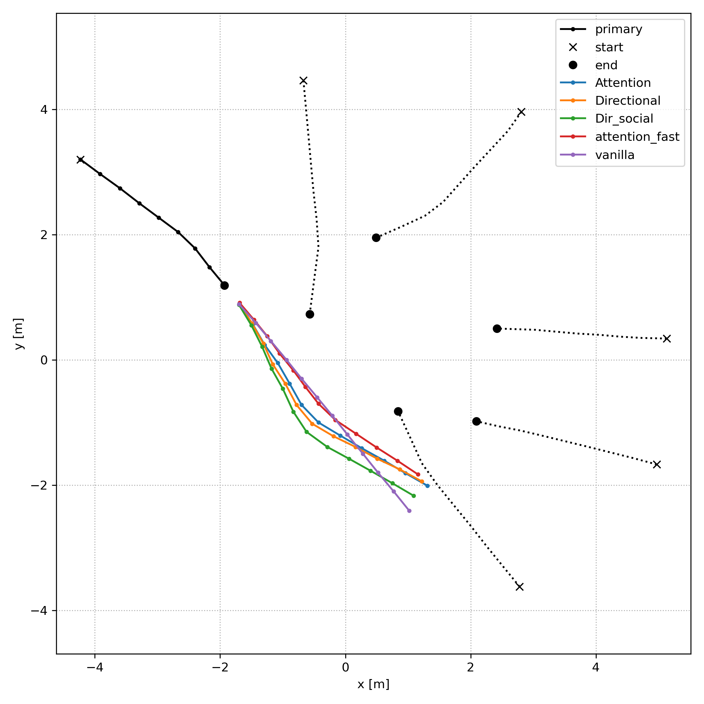
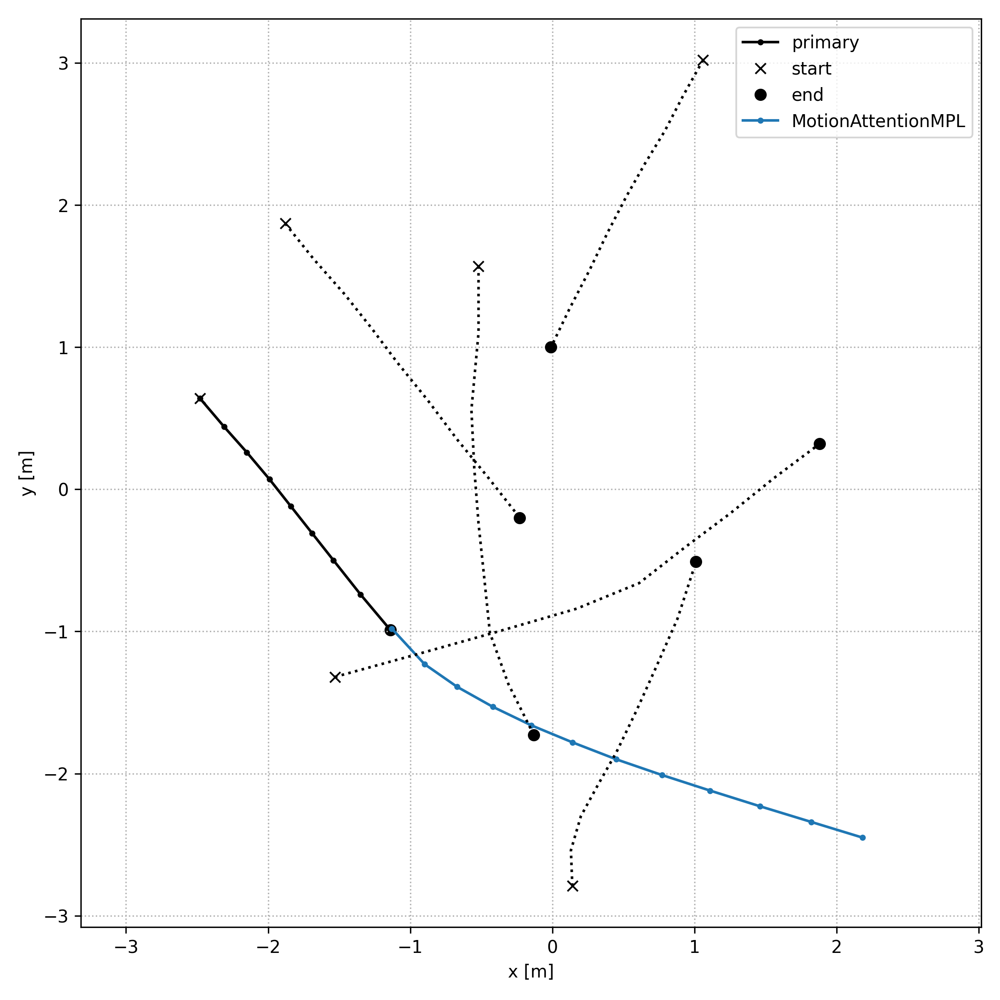
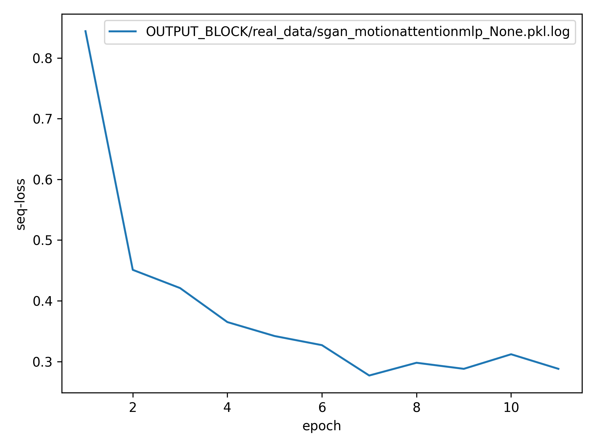

TrajNet++ : The Trajectory Forecasting Framework
================================================

PyTorch implementation of `Human Trajectory Forecasting in Crowds: A Deep Learning Perspective <https://arxiv.org/pdf/2007.03639.pdf>`_ 

TrajNet++ is a large scale interaction-centric trajectory forecasting benchmark comprising explicit agent-agent scenarios. Our framework provides proper indexing of trajectories by defining a hierarchy of trajectory categorization. In addition, we provide an extensive evaluation system to test the gathered methods for a fair comparison. In our evaluation, we go beyond the standard distance-based metrics and introduce novel metrics that measure the capability of a model to emulate pedestrian behavior in crowds. Finally, we provide code implementations of > 10 popular human trajectory forecasting baselines.

In our project, we'll be trying a few implementation and compare it to some baselines of our choice, below are some prediction that we achieved ! 

.. figure:: docs/train/cover.png

Result on Real data
-------------------

Result on synth data
--------------------

Training Models
===============

LSTM
----

Situations where collisions occur are too rare during the training so that the model correctly handles these situations in real scenarios. Thus, the idea is to give additional information to the model during training to avoid collisions. Therefore, we combined the initial LSTM trajectory predictor with the NCE social loss. The NCE social loss tries to maximize the similarity between the query embedded position and a positive key and tries to minimize the similarity between the embedded query position and several negative keys. In that case, the negative keys correspond to locations which correspond to collisions or uncomfortable situations (personal space too small) for the primary pedestrian. Uncomfortable situation positions are sampled around the position of the neighboring pedestrians from the current time step to a given horizon. The positive key corresponds to the embedded position of the primary pedestrian at the given horizon. Intuitively, the NCE loss pushes the primary pedestrian position far from the negative keys and pulls it to the positive key. 

SGAN
----

For SGAN, we decided to compare different pooling method. From milestone 2, we observed that social pooling achieved better result in general. Also, attention pooling is used in many papers and seems relevant here so it catches our attention. 

From the result we saw that social directional achieved the best result in general but unfortunately the result are biased since it was trained on more epochs. The results are in table below :

Motion attention mlp
--------------------

Firstly, inspired by the contrastive learning implemented in milestone 2, we managed to introduce the Social NCE loss to the Social-GAN framework. Concretely, in order to compute the variety loss, first for each of the top K loss we also use a projection head to map the motion features, which is extracted by the LSTM generator, to the embedding space. Then we conduct multi-agent contrastive sampling to get positive and negative samples respectively, and compute the Social NCE loss which is added to the task loss finally. Therefore the variety loss is able to choose the best one not only from multi-modality but also from self-supervised data.

Secondly, inspired by neuron science, the attention mechanism is introduced to deep learning and achieve excellent performance in capturing the motion. Therefore, based on the Attention MLP Pooling proposed in S-BiGAT which obtains the interaction vector by attention-weighting the embeddings of relative coordinates and hidden-state of all neighbours, we proposed a new interaction pooling model to better describe the motions occur in a scenes. We names it Motion Attention MLP Pooling, which attention-weights the embedding of relative positions, relative velocities, relative accelerations as well as hidden-state of all neighbours. 

As for the implementation, we include three continuous frame observations (obs0, obs1, obs2) to fully learn the motion. For example, obs2 is used to describe the position, (obs2 - obs1) is for velocity, and (obs2 - obs1) - (obs1 - obs0) is for acceleration finally. Because of the more complicated observation inputs, the hidden state of our Social-GAN is also extended. Therefore we complicated our model with actual purpose.

For the model training and parameters tuning, due to our inherently complex neuron network structure, we choose lower dimensions for each layer. During the training, initial learning rate 0.0001 works well for our case, which achieves meaningful dropping in loss, FDE and so on. However, because of the time limitation, we are just able to train 6 epochs on synth data (10 on real data) for a whole day so can not see a better result before the deadline. We showed below our loss evolution with the epochs :

Results
-------

Unimodal Comparison of interaction encoder designs on interacting trajectories of TrajNet++ real world dataset. Errors reported are ADE / FDE in meters, collisions in mean % (std. dev. %) across 5 independent runs. Our goal is to reduce collisions in model predictions without compromising distance-based metrics.

+-----------------------------------+-------------+------------+ 
| Method                            |   ADE/FDE   | Collisions | 
+-----------------------------------+-------------+------------+   
| D-LSTM (ours)                     |  0.56/1.22  |  5.4 (0.3) |
+-----------------------------------+-------------+------------+ 
| D-LSTM (milestone 1)              |  0.65/1.41  |  5.9       |
+-----------------------------------+-------------+------------+
| D-LSTM (milestone 2 single 1)     |  0.51/1.12  |  4.01      |
+-----------------------------------+-------------+------------+
| D-LSTM (milestone 2 single 2)     |  0.51/1.09  |  4.01      |
+-----------------------------------+-------------+------------+
| D-LSTM (milestone 2 multi)        |  0.51/1.12  |  3.62      |
+-----------------------------------+-------------+------------+
| SGAN vanilla                      |  0.64/1.37  |  8.96      |
+-----------------------------------+-------------+------------+
| SGAN directionnal                 |  0.52/1.12  |  4.23      |
+-----------------------------------+-------------+------------+
| SGAN social directional           |  0.53/1.11  |  3.75      |
+-----------------------------------+-------------+------------+
| SGAN attention                    |  0.52/1.12  |  4.51      |
+-----------------------------------+-------------+------------+
| SGAN attention fast               |  0.53/1.15  |  6.26      |
+-----------------------------------+-------------+------------+
| fully trained VAE                 |  2.25/4.62  |  12.91     |
+-----------------------------------+-------------+------------+
| Motion att MLP (6 epochs)         |  0.87/1.53  |  9.31      |
+-----------------------------------+-------------+------------+

Results discussion
------------------ 

We estimate that our best result is 

milestone 1 link: 
https://www.aicrowd.com/challenges/trajnet-a-trajectory-forecasting-challenge/submissions/132467
milestone 2 link (single 1): 
https://www.aicrowd.com/challenges/trajnet-a-trajectory-forecasting-challenge/submissions/137789 (version 1)
milestone 2 link (single 2): 
https://www.aicrowd.com/challenges/trajnet-a-trajectory-forecasting-challenge/submissions/138913 (version 2)
milestone 2 link (multi): 
https://www.aicrowd.com/challenges/trajnet-a-trajectory-forecasting-challenge/submissions/138597

Citation
========

The used Trajnet++ Baseline code was developed by

.. code-block::

    @article{Kothari2020HumanTF,
      title={Human Trajectory Forecasting in Crowds: A Deep Learning Perspective},
      author={Parth Kothari and S. Kreiss and Alexandre Alahi},
      journal={ArXiv},
      year={2020},
      volume={abs/2007.03639}
    }

